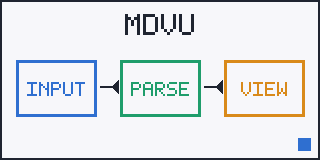

# Azure DevOps Wiki showcase

[[_TOC_]]

## Work items and mentions

Fixed #1234 after review by @jane.doe and @build-team.

## Math

Inline math $E = mc^2$ is shown as source, and so is $$\sum_{i=1}^{n} i$$.

## Table with cell breaks

| Stage | Notes |
|:------|:------|
| build | compile package |
| test | unit integration |

## Details

Rollback plan

Revert the release branch and redeploy the previous tag.

## Diagram

::: mermaid
graph LR
  A[Plan] --> B[Build] --> C[Ship]
:::

## Attachments

[design.xlsx](.attachments/design.xlsx)

[[_TOSP_]]
